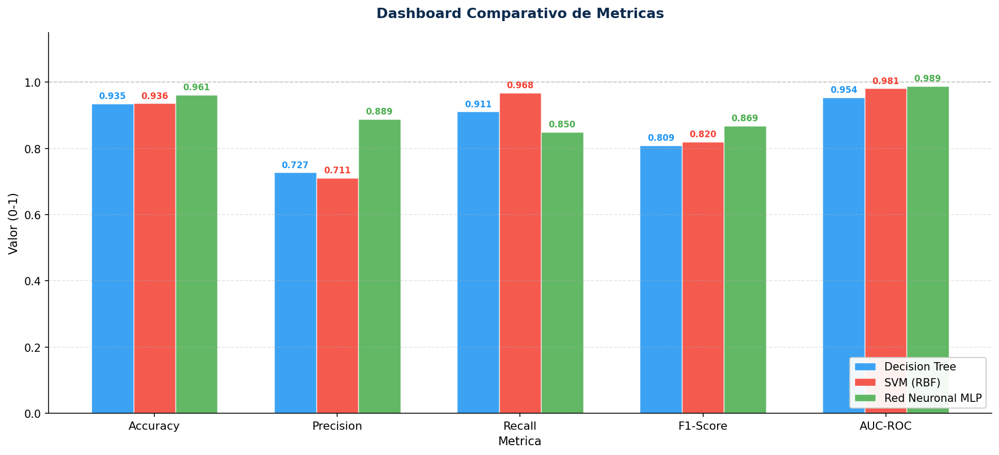
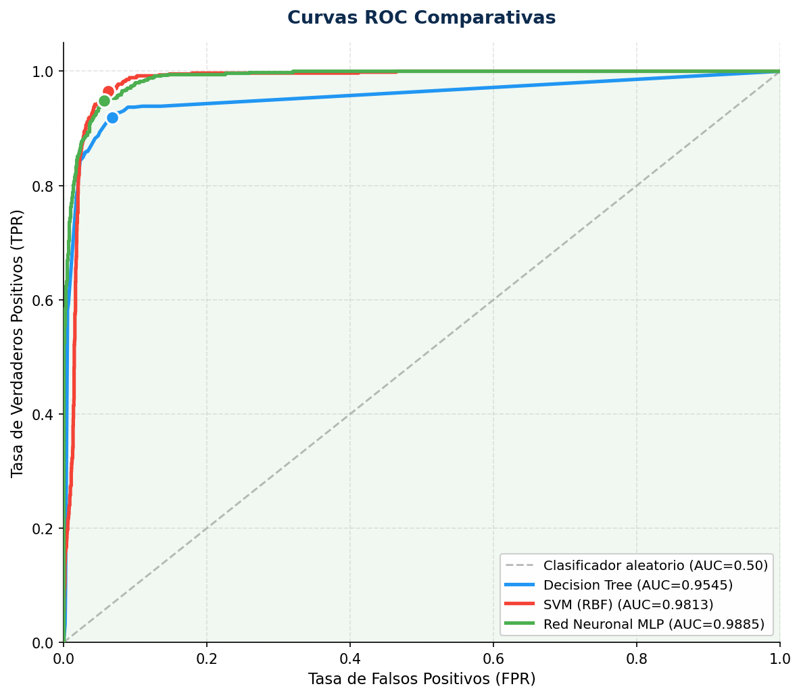
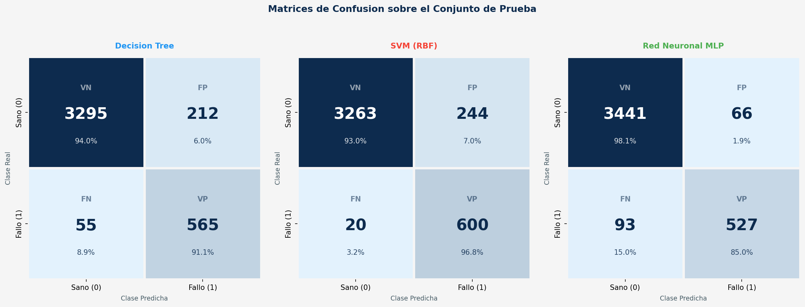
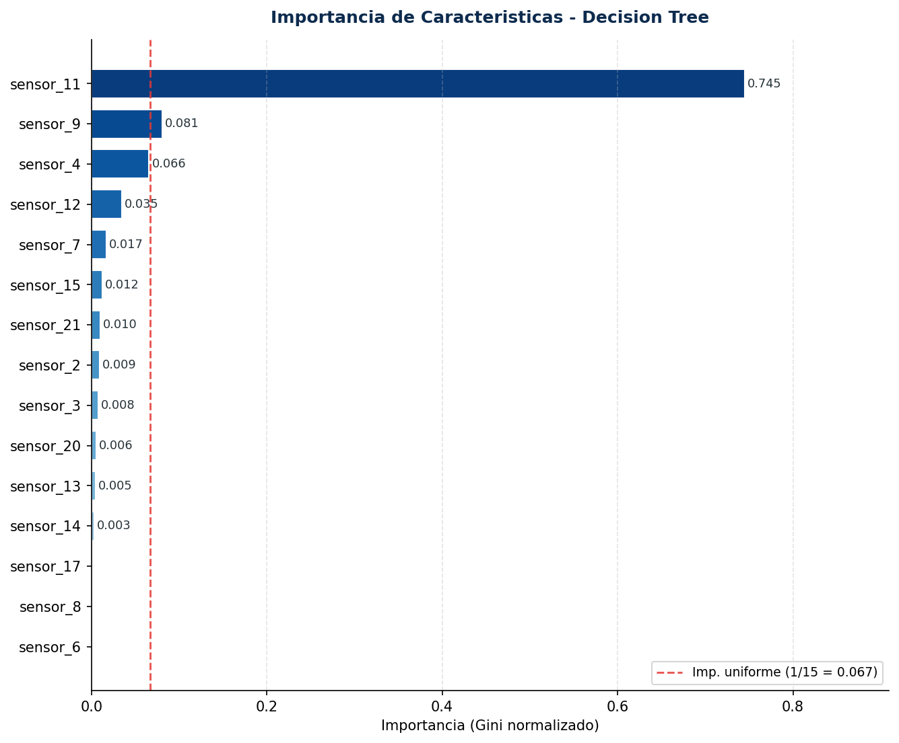

# Mantenimiento Predictivo de Motores Turbofán — NASA C-MAPSS

Sistema de detección de fallos inminentes en motores turbofán utilizando Machine Learning sobre el dataset **NASA C-MAPSS FD001**. El proyecto compara tres algoritmos de clasificación (Decision Tree, SVM y Red Neuronal MLP) para predecir si un motor fallará en los próximos 30 ciclos de vuelo.

> Proyecto académico — Escuela de Ingenierías Industriales, Universidad de Valladolid  
> **Autores:** Gonzalo Alonso Andrés · David Domingo Hermoso

---

## 📋 Descripción del Problema

Los motores turbofán comerciales generan grandes volúmenes de datos a través de sensores (temperatura, presión, RPM…). El objetivo es transformar un problema de regresión (predicción de Remaining Useful Life) en **clasificación binaria**:

| Clase | Significado | Condición |
|-------|-------------|-----------|
| **0** | Funcionamiento normal | RUL > 30 ciclos |
| **1** | Fallo inminente | RUL ≤ 30 ciclos |

El dataset FD001 simula un único modo de fallo (degradación del compresor de alta presión) bajo una condición operativa, con 100 motores y 21 sensores por ciclo.

---

## 🧠 Modelos Implementados

- **Decision Tree** — Profundidad máxima de 8, con `class_weight='balanced'`
- **SVM (RBF)** — Kernel de Función de Base Radial, compensación de desbalanceo
- **Red Neuronal MLP** — Dos capas ocultas (64, 32 neuronas), activación ReLU, optimizador Adam

---

## 📊 Resultados

| Modelo | Accuracy | Precision | Recall | F1-Score | AUC-ROC |
|--------|----------|-----------|--------|----------|---------|
| Decision Tree | 0.9353 | 0.7272 | 0.9113 | 0.8089 | 0.9545 |
| SVM (RBF) | 0.9360 | 0.7109 | **0.9677** | 0.8197 | 0.9813 |
| Red Neuronal MLP | **0.9615** | **0.8887** | 0.8500 | **0.8689** | **0.9885** |

### Dashboard Comparativo de Métricas


### Curvas ROC


### Matrices de Confusión


### Importancia de Características (Decision Tree)


> El **sensor 11** (presión estática del compresor de alta presión) concentra el **74.5%** de la importancia predictiva total.

---

## 🗂️ Estructura del Repositorio

```
├── TurbinaNasa.py          # Script principal
├── data/
│   ├── train_FD001.txt     # Datos de entrenamiento (100 motores)
│   ├── test_FD001.txt      # Datos de prueba
│   └── RUL_FD001.txt       # RUL real del conjunto de test
├── images/                 # Gráficas generadas
│   ├── confusion_matrices.png
│   ├── roc_curves.png
│   ├── feature_importance.png
│   └── dashboard_metrics.png
└── README.md
```

---

## 🚀 Instalación y Ejecución

```bash
# Clonar el repositorio
git clone https://github.com/tu-usuario/turbofan-predictive-maintenance.git
cd turbofan-predictive-maintenance

# Instalar dependencias
pip install numpy pandas matplotlib seaborn scikit-learn

# Ejecutar
python TurbinaNasa.py
```

El script genera 5 gráficas interactivas y un resumen en consola con las métricas de los tres modelos.

---

## 🔧 Preprocesamiento

1. **Selección de características** — Se eliminan sensores con varianza nula (1, 5, 10, 16, 18, 19) y las configuraciones operativas
2. **Estandarización Z-score** — Todas las variables se normalizan a media 0 y desviación estándar 1
3. **Etiquetado binario** — RUL ≤ 30 → Fallo inminente (1), RUL > 30 → Sano (0)

---

## 📖 Dataset

**NASA C-MAPSS** (Commercial Modular Aero-Propulsion System Simulation) — Subconjunto FD001.

- **Fuente:** [NASA Prognostics Data Repository](https://www.nasa.gov/intelligent-systems-division/discovery-and-systems-health/pcoe/pcoe-data-set-repository/) | [Kaggle](https://www.kaggle.com/datasets/behrad3d/nasa-cmaps)
- **Motores:** 100 (entrenamiento) + 100 (test)
- **Sensores:** 21 variables físicas por ciclo
- **Ratio de desbalanceo:** 5.7:1 (sano vs fallo)

---

## 📝 Licencia

Proyecto académico con fines educativos. El dataset pertenece a la NASA y es de uso público.
